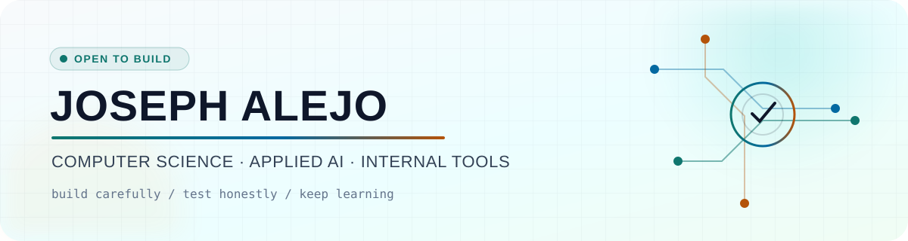
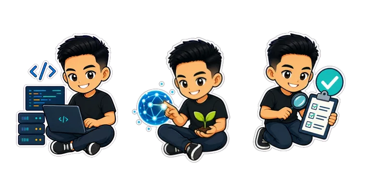

<picture>
  <source media="(prefers-color-scheme: dark)" srcset="./assets/banner-dark.svg">
  <source media="(prefers-color-scheme: light)" srcset="./assets/banner-light.svg">
  
</picture>

<div align="center">
  <a href="https://joseph-alejo-portfolio.vercel.app"></a>
  <a href="https://www.linkedin.com/in/joseph-alejo-deocampo/"></a>
  <a href="https://www.credly.com/users/joseph-alejo.c75c59d6/badges"></a>
</div>

## About me

I’m a **Computer Science student focused on AI, machine learning, and full-stack development**. I build practical web applications, backend APIs, internal tools, and applied-AI prototypes that translate real workflows into useful software.

My current hands-on work includes helping a collaborative team modernize an operational information system. Across my projects, I work with authentication, role-based access, databases, REST APIs, automated testing, and data-driven features. I use AI-assisted tools to explore and prototype faster, then trace the implementation, verify its behavior, document key decisions, and strengthen my understanding before considering the work complete.

## Signal deck

<table>
  <tr>
    <td width="48%" valign="top">
      <h3>🛰️ Developer signal</h3>
      <pre>location   Philippines
focus      backend + applied AI
systems    internal tools + APIs
quality    testing + documentation</pre>
    </td>
    <td width="52%" valign="top">
      <h3>🧭 Current trajectory</h3>
      <ul>
        <li><strong>Deepening:</strong> Python, JavaScript, APIs, databases, and automated testing</li>
        <li><strong>Exploring:</strong> reliable backend systems, applied AI, and software QA</li>
        <li><strong>Open to:</strong> part-time, freelance, internship, and junior opportunities</li>
      </ul>
    </td>
  </tr>
</table>

<div align="center">
  
  <br>
  <sub>backend · applied AI · quality</sub>
</div>

## Selected work

| Project | What it explores | Stack |
|---|---|---|
| **AparTrack** | Team-built rental operations system with tenant, billing, deposit, audit, and role-based workflows | Node.js · Express · MongoDB · JWT · Jest · Playwright |
| **[LuntiAI](https://github.com/wrnzn/LuntiAI)** | Barangay-level crop recommendations using local soil, weather, and crop data | Python · FastAPI · scikit-learn · SQLite |
| **[Retail Robustness Studio](https://github.com/wrnzn/RetailRobustnessStudio)** | Comparing vision-model behavior under blur, noise, and occlusion | Python · Gradio · MobileNetV3 · TinyMobileViT |
| **[ForUMhub](https://github.com/wrnzn/ForUMHUB)** | Campus community forum and marketplace designed around student interaction | Flutter · Dart · Firebase |

<div align="center">

## Toolbox

### Application layer


### Data & intelligence


### Quality & workflow


</div>

## Activity loop

<div align="center">
  <picture>
    <source media="(prefers-color-scheme: dark)" srcset="https://raw.githubusercontent.com/wrnzn/wrnzn/output/contribution-trail-dark.svg">
    <source media="(prefers-color-scheme: light)" srcset="https://raw.githubusercontent.com/wrnzn/wrnzn/output/contribution-trail.svg">
    
  </picture>
  <br>
  <sub>Public contributions, redrawn daily · teal grid, amber runner</sub>
</div>

## Engineering approach

```text
prototype with curiosity → inspect the code → test the behavior
                         → explain the trade-offs → improve it deliberately
```

I use AI-assisted tools to accelerate exploration and prototyping while taking responsibility for the result: **understand the implementation, verify its behavior, document key decisions, and improve what breaks.**

## Let’s connect

If you’re building a useful web, data, healthcare, agriculture, or internal-tools project, I’d be glad to hear about it.

**[Portfolio](https://joseph-alejo-portfolio.vercel.app)** · **[LinkedIn](https://www.linkedin.com/in/joseph-alejo-deocampo/)** · **[Email](mailto:josephalejo1412@gmail.com)**

<div align="center">
  <sub>Build carefully. Test honestly. Keep moving.</sub>
</div>
